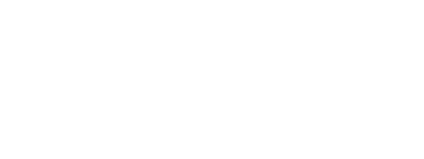

  

  
  
  ### Full-Stack Developer 
  
  `> SYS_READY` &nbsp; &nbsp; | &nbsp; &nbsp; `> BUILDING_SCALABLE_SOLUTIONS`

---

### `// ABOUT_ME`
My focus is on writing robust code and turning complex or operational problems into elegant systems. 

### `// TECH_STACK`
* **Frontend:** React, TailwindCSS, Flutter
* **Backend:** Python, Dart, Java, JS
* **Database:** SQL, SQLite
* **Tools and Infrastructure:**  Linux, Git, Figma, Docker, Android Studio

### `// CURRENT_PROCESSES`
- 🔭 Actively developing full-stack applications, dabbling in mobile app development.
- ⚡ Exploring new methodologies in data parsing.
- 🌱 Continuous refinement.

---

### `[INITIATE_CONTACT_PROTOCOL()]`

[Website](https://lavanya-vanwyk.netlify.app/) • [LinkedIn](https://www.linkedin.com/in/lavanya-van-wyk-072a2a125/) 

